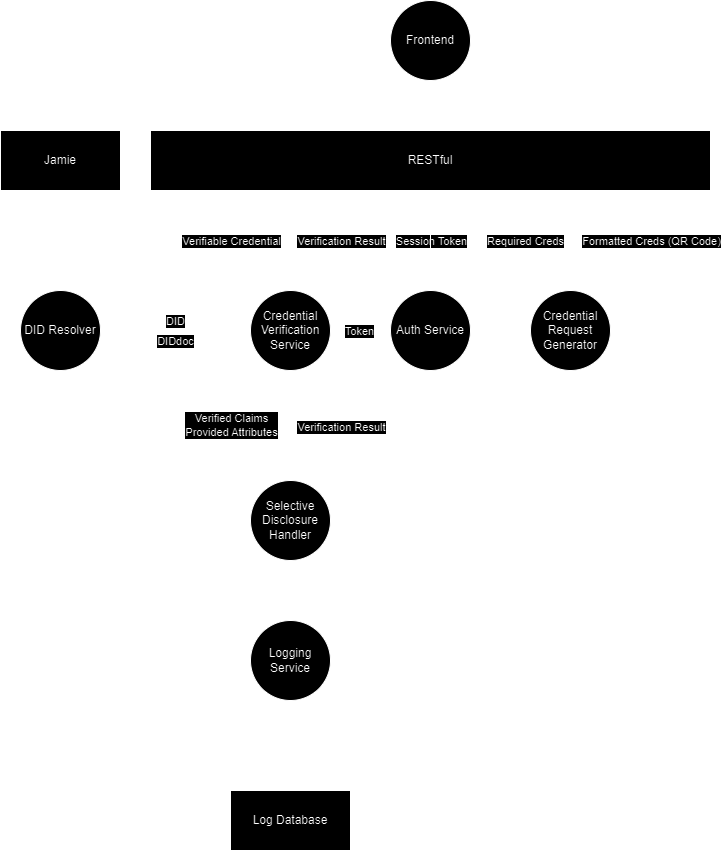

# Service Provider

# SSI Service Provider Component

This repository contains the Service Provider component for our Self-Sovereign Identity (SSI) system. The Service Provider component is responsible for requesting and verifying credentials from Identity Owners.

## Features

- Request verifiable credentials from Identity Owners
- Verify the authenticity and integrity of presented credentials
- Support for selective disclosure of credential attributes
- Unlinkable credential presentations to protect user privacy
- Extensible design to support various credential formats and signature schemes
- Alignment with emerging SSI standards

## Contact

If you have any questions or need support, please contact ricky.zhang@student.unsw.edu.au

